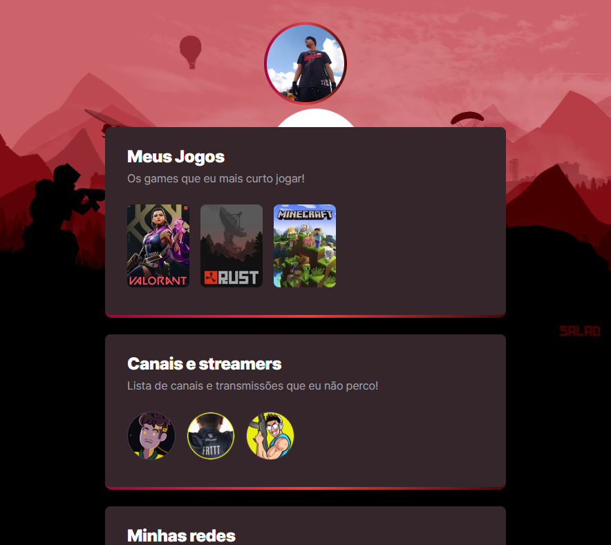

# NLW eSports

> Trilha Explorer

Projeto construído do evento Next Level Week da Rocketseat. 🚀

[Clique aqui para acessar](https://lkswp.github.io/nlw-esports-explorer)

## 🔎 Tecnologias:

- HTML
- CSS
- Git e Github

## 📚 O que aprendi:

Nesse projeto aprendi como funciona as "caixas" no CSS e como fazer um gradiente.

Mexer com SVG, colocar e redimensionar Ancoras.

## 🧾 Contato:

lucalucas8111@gmail.com